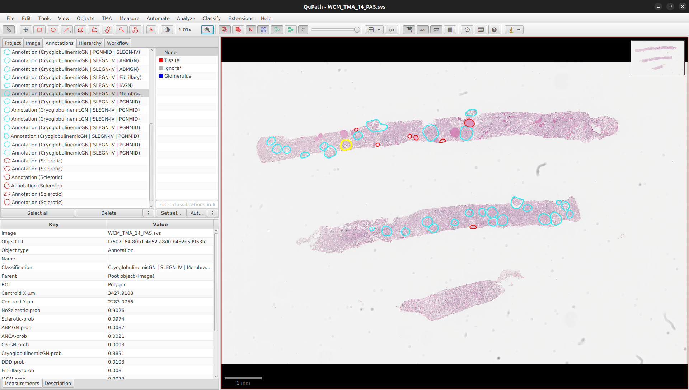

# GDCnn

GDCnn (*G*lomerular *D*isease *C*lassification by *n*eural *n*etwork) is an
extension which integrates a pipeline for glomerular detection and classification
into QuPath. The pipeline is designed to classify glomeruli into sclerosed and
non-sclerosed classes, and to further classify non-sclerosed glomeruli into
12 other pathologies.

The pipeline is based on the [MESCnn](https://github.com/Nicolik/MESCnn) 
pipeline, which was developed for the Oxford classification of glomeruli in
IgA nephropathy. The paper for MESCnn can be found at 
[https://www.sciencedirect.com/science/article/pii/S0169260723004807](https://www.sciencedirect.com/science/article/pii/S0169260723004807),
and its citation in BibTeX is the following:

```
@article{ALTINI2023107814,
title = {Performance and Limitations of a Supervised Deep Learning Approach for the Histopathological Oxford Classification of Glomeruli with IgA Nephropathy},
journal = {Computer Methods and Programs in Biomedicine},
pages = {107814},
year = {2023},
issn = {0169-2607},
doi = {https://doi.org/10.1016/j.cmpb.2023.107814},
url = {https://www.sciencedirect.com/science/article/pii/S0169260723004807},
author = {Nicola Altini and Michele Rossini and Sándor Turkevi-Nagy and Francesco Pesce and Paola Pontrelli and Berardino Prencipe and Francesco Berloco and Surya Seshan and Jean-Baptiste Gibier and Anibal Pedraza Dorado and Gloria Bueno and Licia Peruzzi and Mattia Rossi and Albino Eccher and Feifei Li and Adamantios Koumpis and Oya Beyan and Jonathan Barratt and Huy Quoc Vo and Chandra Mohan and Hien Van Nguyen and Pietro Antonio Cicalese and Angela Ernst and Loreto Gesualdo and Vitoantonio Bevilacqua and Jan Ulrich Becker},
}
```

## Dependencies

The extension requires the following dependencies:

- Python 3.8 or 3.9 (not higher)
- CUDA-compatible GPU

## Installation
> [!WARNING]
> This extension **is developed for QuPath 0.5.0**, and has not been tested with other versions.
>
> This extension requires a CUDA-compatible GPU, and has been tested only with CUDA 11.1.

**0.** Install Python 3.8 or 3.9 (not higher) on your system.

<!-- **0.** Install on your system the following dependencies:

- Python 3.8 or 3.9 (not higher)
- Git LFS (for downloading the model weights) -->

**1.** Download the `.jar` file for the extension from the [Releases](https://github.com/israelMateos/qupath-extension-gdcnn/releases/latest) page.

**2.** In `install/install.cfg`, define the following variables:

- `qupath_path`: the path to the QuPath installation directory. It should contain the `bin` directory, in which the `QuPath` executable is located.
- `extension_path`: the path to the `.jar` file downloaded in step 1. It should include the file name.
  
**3.** From the `install` directory, run the following command:

```bash
bash install.sh
```

This script will copy the extension `.jar` file to the QuPath extensions directory, and will create a new directory for the GDCnn extension in the QuPath extensions directory. The next time you open QuPath, the extension will be available in the menu.

## Usage
The extension adds a new menu item to QuPath, called *GDCnn*. This menu item contains the button *Open GDCnn*.

This button opens a dialog window, where you can select the image/s you want to analyze.
You must also select the classification mode: *Sclerosed vs Non-Sclerosed* or *Sclerosed + 12 classes*.

After selecting the image/s and the classification mode, click:

- *Run Detection* to detect glomeruli in the image/s.
- *Run Classification* to classify "Glomerulus" annotations into the selected classes.
- *Run Detection + Classification* to run both detection and classification.


The glomeruli are automatically annotated in the corresponding images. An example of the annotations is shown below:



Another button, *View results*, opens a dialog window with the results of the selected image/s.
The results are shown in a table, where each WSI presents:

- The number of glomeruli detected.
- The number of glomeruli for each class.
- The 3 most probable classes for the WSI.


## Building the extension

To build the extension from source, use the following command from the root directory of the repository:

```bash
./gradlew clean shadow
```

The extension `.jar` file will be generated in the `build/libs` directory.

## Bug with Ubuntu

If you are using Ubuntu, you may get `Ubuntu Error 13: Permission denied` when trying to run the extension. As stated in [this issue](https://forum.image.sc/t/could-not-execute-system-command-in-qupath-thanks-to-groovy-script-and-java-processbuilder-class/61629/2?u=oburri), Java's `ProcessBuilder` class is not allowed to run on Ubuntu.

To fix this, QuPath must be [built from source](https://qupath.readthedocs.io/en/stable/docs/reference/building.html) instead of using the installer. This will allow the extension to run without issues.

## License

This extension is licensed under the GNU General Public License v3.0. For more information, see the [LICENSE](LICENSE) file.