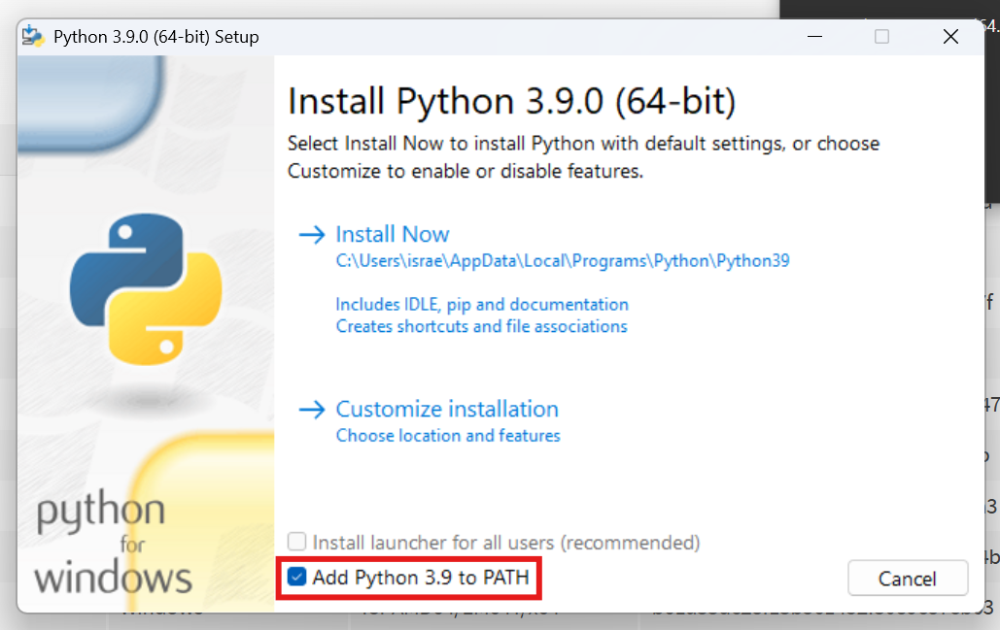

# GNCnn Installation

> [!WARNING]
> This extension **is developed for QuPath 0.5.0 or higher**, and has not been tested with other versions.
>
> If you have a NVIDIA GPU, the extension only supports CUDA 11.1 for v0.1.x or CUDA 11.8 for v0.2.x. The extension will use the GPU by default if it is available. If you do not have a GPU, the extension will use the CPU.

GNCnn was tested on Ubuntu 20.04 and 22.04, Windows 10 and macOS Big Sur 11.4.

**0.** Install:

- For GNCnn 0.1.x:
  - Python 3.8 or 3.9
  - CUDA 11.1 if you are using a NVIDIA GPU

- For GNCnn 0.2.x:
  - Python 3.9
  - CUDA 11.8 if you are using a NVIDIA GPU
 
> [!IMPORTANT]
> When installing Python, make sure to check the option to add Python to the system PATH as in the following image:
>
> 

**1.** Download the `.jar` file for the extension from the [Releases](https://github.com/israelMateos/qupath-extension-gncnn/releases/latest) page.

**2.** This step depends on the platform you are using.

- **Linux**: edit `install/linux.cfg`.
- **Windows**: edit `install/windows.cfg`.
- **macOS**: edit `install/mac.cfg`.

In the configuration file, you should set the following variables:

- `qupath_path`: 
  - For Linux, the path to the QuPath installation directory. It should contain the `bin` directory, in which the `QuPath` executable is located.
  - For Windows and macOS, the path to the QuPath executable. In Windows, it should include the console version of QuPath, _e.g._ `QuPath-0.5.1 (console).exe`. In macOS, it should include the executable buried inside the `.app` directory, _e.g._ `QuPath-0.5.1-x64.app/Contents/MacOS/QuPath-0.5.1-x64`.
- `extension_path`: the path to the `.jar` file downloaded in step 1. It should include the file name.
  
**3.** From the `install` directory, run the following command:

- **Linux**:

```bash
bash install.sh
```

- **Windows**:

```bash
.\install.bat
```

- **macOS**:

```bash
sh install.sh
```

This script will install the Python tool on which the extension depends, and will download the model weights. It will also create a new directory for the GNCnn extension in the QuPath extensions directory. The next time you open QuPath, the extension will be available in the menu.

**4.** Once the extension is installed, you can remove this repository's directory (`qupath-extension-gncnn`) from your system.

## Troubleshooting

### Installation fails with SSL error

If the installation fails with an SSL error, it may be due to firewall corporate restrictions, not allowing the download of the model weights. To fix this, you can:
- Use a different network.
- Contact your network administrator to allow the installation.
- Contact the main developer, [Israel Mateos-Aparicio](mailto:israel.MateosAparici@uclm.es?subject=[GNCnn]%20Installation%20issue), to get the model weights and manually copy them to the `gncnn` directory in the QuPath extensions directory.